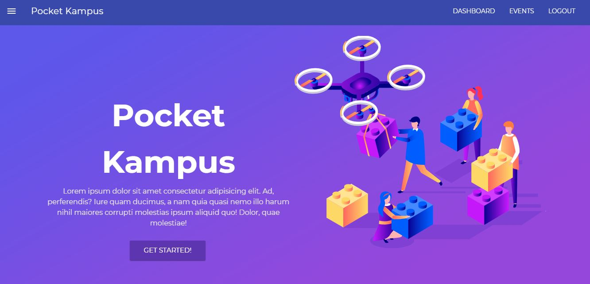

# Pocket Kampus 

<p align="center">
  <a href="#" rel="noopener">
 </a>
</p>


---

> Managing College Life is now super simple!

---

## Features

- Calendar View
- Reminders
- Subjects : Submissions and Lectures
- Attendance Tracker
- Events Explore Page
- Emails upon Event Registration
- e-Library

---

## Requirements

- Node.js and Node package manager (npm)

---

## Installation & Setup

```sh
$ git clone https://github.com/RyanDsilva/college-kampus-frontend.git

$ npm i

$ npm run dev
```

---

## Contributers

- [Ryan Dsilva](https://github.com/RyanDsilva)
- [Neha Patil](https://github.com/Nehaa-Patil)
- [Ashna Shah](https://github.com/ashna111)
- [Anushka Paradkar](https://github.com/anushkaparadkar)
